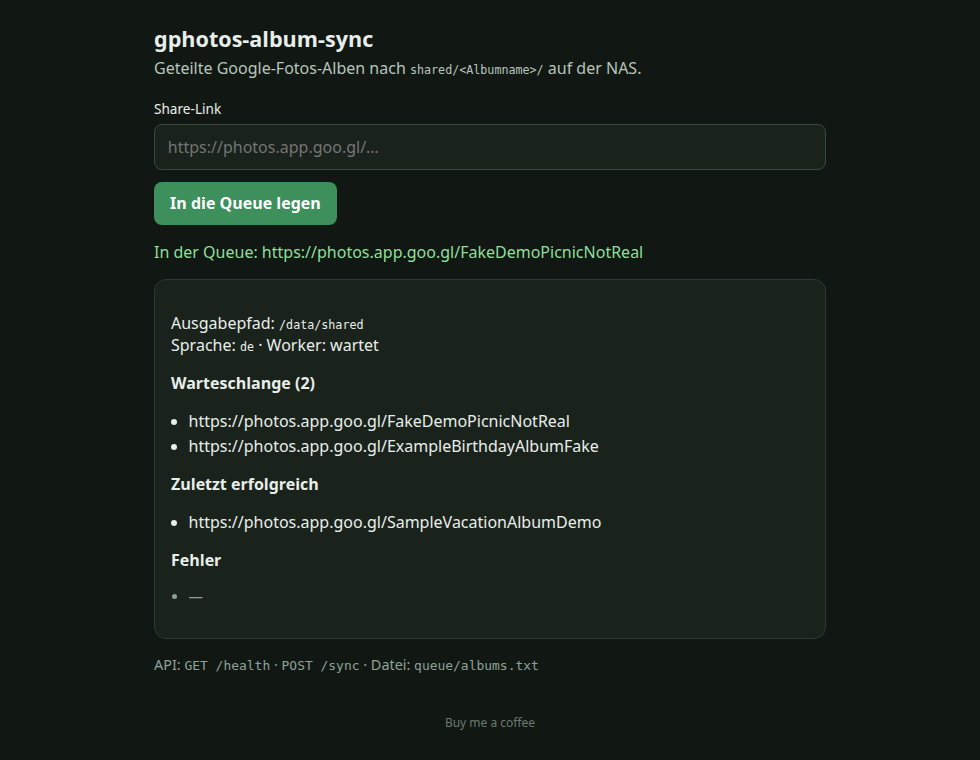

# gphotos-album-sync

> Deutsch: siehe [README.de.md](README.de.md)

A self-contained Docker Compose stack that downloads **shared Google Photos albums** from share links to folders on a NAS—one folder per album under `shared/`.

```
<DATA_DIR>/shared/<Album name>/…
```

There is **no Immich integration**, no Google Cloud API key, and no stored Google password. This is a single-purpose service that writes to the filesystem.

> **Google Photos API limitation:** The Google Photos Library API provides only limited support for shared albums for third-party applications. It is not a full, documented replacement for “download all media from a share link”. This tool therefore deliberately uses the Google Photos web UI (like a browser), not API keys.

## Web UI



*Local page at `http://<host>:8090/`. The album links in this screenshot are fake examples, not real albums.*

## How it works

1. Put one share URL per line in `queue/albums.txt`, or send `POST /sync` with JSON such as `{"url":"https://photos.app.goo.gl/…"}`.
2. The worker opens the link in Chromium (Selenium, following the same flow as gp-dl 0.4.x): menu → **Download all** → ZIP.
3. Files are stored in `/data/shared/<Album title>/`. The title comes from the page title; unsafe characters are removed.
4. Completed URLs move to `queue/done.txt`; failures move to `queue/failed.txt` (the reason is recorded in the logs).
5. Queueing the same link again performs another sync. Existing files with the same names are skipped; new files are added.

The primary mode uses public share links and does not require a Google login. A Chrome profile (`./profile` → `/profile`) is prepared for private albums later with `USE_CHROME_PROFILE=true`.

## Quick start on a NAS

```bash
cp .env.example .env
# Set DATA_DIR to the desired NAS share, for example:
# DATA_DIR=/volume1/photos/gphotos-album-sync

docker compose up -d --build
curl -s http://127.0.0.1:8090/health
```

For Portainer, see the short checklist in [DEPLOY.md](DEPLOY.md).

### Mounting the NAS share

Configure the mount in `.env` or `docker-compose.yml`:

| Host | Container | Purpose |
|---|---|---|
| Host share (for example `/volume1/photos/gphotos-album-sync`) | `/data` | Sync root; albums are placed under `shared/` |
| `./queue` | `/queue` | URL queue |
| `./profile` | `/profile` | Optional Chrome profile |

Result on disk:

```
/data/shared/<Album name>/photo.jpg
→ <DATA_DIR>/shared/<Album name>/photo.jpg  (NAS share / SMB mount)
```

If the Compose host is not the Synology itself, mount the SMB share first and use its mount point as `DATA_DIR`.

Do not remove `shm_size: 2gb`; Chromium needs the shared memory.

## Adding a link

**File queue** (one URL per line; `#` starts a comment):

```bash
cp queue/albums.txt.example queue/albums.txt   # first use only
echo 'https://photos.app.goo.gl/xxxxxxxxxxxxxxxxxxxxxx' >> queue/albums.txt
```

The worker reads the file every `POLL_SECONDS` seconds (30 by default) and removes each URL after processing it.

**API:**

```bash
curl -s -X POST http://NAS-IP:8090/sync \
  -H 'Content-Type: application/json' \
  -d '{"url":"https://photos.app.goo.gl/xxxxxxxxxxxxxxxxxxxxxx"}'
```

The response is `{"status":"queued","url":"…"}`. Check progress with `GET /status` or the small page at `http://NAS-IP:8090/`.

Health check:

```bash
curl -s http://NAS-IP:8090/health
```

## Environment variables

See `.env.example`. The important settings are:

| Variable | Default | Purpose |
|---|---|---|
| `GOOGLE_LANG` | **`de`** | UI language / aria labels (`Weitere Optionen`, `Alle herunterladen`, `Teilen`). gp-dl 0.4.x uses the same variable. |
| `OUTPUT_ROOT` | `/data/shared` | Destination inside the container |
| `HTTP_PORT` | `8090` | Host port for the API |
| `POLL_SECONDS` | `30` | How often `albums.txt` is read |
| `WEB_DRIVER_WAIT` | `25` | Selenium timeout for buttons |
| `DOWNLOAD_TIMEOUT` | `1800` | Maximum seconds to wait for the ZIP |
| `SKIP_EXISTING` | `true` | Do not overwrite files with the same name |
| `USE_CHROME_PROFILE` | `false` | For private albums only |
| `CHROME_BINARY` | `/usr/bin/chromium` | Same as gp-dl |
| `DEBUG_DUMPS` | `false` | Save screenshots and HTML to `queue/debug/` on errors |

`GOOGLE_LANG=de` also sets Chrome's `--lang=de-DE`, so the German Google Photos UI appears instead of the English labels “More options” and “Download all”.

Other gp-dl-compatible variables include `CHROME_BINARY`, `WEB_DRIVER_WAIT`, and `WSL_INSIDE` (set to `true` in the image so headless “new” mode is used).

## Notes and limitations

- **Terms of service:** The tool controls the Google Photos web UI like a browser, not an official API. This may conflict with Google's ToS. Use it only for albums you own or that were shared with you.
- **UI scraping is fragile:** Google can change buttons and aria labels. If clicking “Download all” fails, check the logs, optionally enable `DEBUG_DUMPS=true`, and verify `GOOGLE_LANG`.
- A **share link is required** in the default mode. An unshared album will not work without a logged-in Chrome profile. Do not store passwords in Compose.
- **Large albums and ZIP limits:** Google packages “Download all” as a ZIP. Very large albums may fail, split into multiple archives, or take a long time (`DOWNLOAD_TIMEOUT`). Videos and original-quality media make archives larger.
- **No login and no API keys** are needed for public links. Private albums require an already signed-in Chrome profile (`PROFILE_DIR` / `USE_CHROME_PROFILE`).
- The HTTP API has **no authentication**. Use it only on a trusted LAN; do not expose it to the internet.
- Chromium runs with `--no-sandbox`, `--disable-dev-shm-usage`, and `--headless=new`.

## Development and tests

```bash
python3 -m pip install -r requirements-dev.txt
python3 -m pytest -q
docker compose config
```

Python 3.11+, one service, FastAPI (`GET /health`, `POST /sync`), plus a queue watcher.

## Related projects and credits

This repository is an independent NAS/Docker stack (share link → shared album folder). The download flow is inspired by existing open-source tools:

- [gp-dl](https://codeberg.org/csd4ni3l/gp-dl) — Selenium/Chromium download of Google Photos albums (UI labels and the `GOOGLE_LANG` idea).
- [gPhotos2Immich](https://github.com/warreth/gPhotos2Immich) — a pipeline toward Immich (a different goal; this project has **no** Immich integration).

This project is licensed under the **MIT License**; see [LICENSE](LICENSE).

## Buy me a coffee

If this stack helps and you would like to say thanks: [buymeacoffee.com/andyamber](https://buymeacoffee.com/andyamber)
